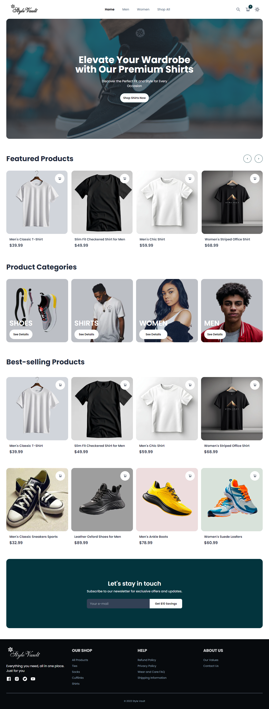

# Style Vault

Welcome to Style Vault, an e-commerce website project designed to offer a seamless shopping experience for clothes, shoes, and accessories for both men and women. This project leverages cutting-edge technologies to deliver a dynamic, responsive, and user-friendly platform.

## Table of Contents

- [Project Overview](#project-overview)
- [Features](#features)
- [Screenshots](#screenshot)
- [Tech Stack](#tech-stack)
- [Getting Started](#getting-started)
  - [Installation](#installation)
  - [Usage](#usage)
- [Contributing](#contributing)
- [License](#license)
- [Contact](#contact)

## Project Overview

Style Vault is an e-commerce platform built with Next.js and Typescript. It features a modern design with smooth animations using Framer Motion, and seamless payment integration via Paystack. Tailwind CSS is utilized for efficient styling, and commerce.js handles the e-commerce functionalities.

## Features

- Responsive design for mobile and desktop
- Product browsing and searching
- Product details with high-quality images
- Shopping cart and checkout process
- Secure payment gateway via Paystack
- Smooth animations and transitions with Framer Motion

## Screenshot



## Tech Stack

- **Framework**: Next.js
- **Language**: TypeScript
- **E-commerce**: commerce.js
- **Animations**: Framer Motion
- **Styling**: Tailwind CSS
- **Payment Gateway**: Paystack
- **State Management**: Zustand
- **Form Validation**: React Hook Form
- **Carousel/Slider**: Swiper.js
- **Notification**: React Hot Toast
- **Theme Provider Handler**: Next-Themes

## Getting Started

To get a local copy of the project up and running, follow these steps.

### Prerequisites

Ensure you have the following installed:

- Node.js (version 12 or later)
- npm (version 6 or later) or yarn

### Installation

1. Clone the repo
   ```sh
   git clone https://github.com/peterxavier01/style-vault.git
   ```
2. Navigate to the project directory
   ```sh
   cd style-vault
   ```
3. Install dependencies

   ```sh
   npm install
   ```

   or

   ```sh
   yarn install
   ```

### Usage

1. Start the development server

   ```sh
   npm run dev
   ```

   or

   ```sh
   yarn dev
   ```

2. Open your browser and go to http://localhost:3000 to view the website.

## Contributing

Contributions are what make the open source community such an amazing place to be learn, inspire, and create. Any contributions you make are greatly appreciated.

1. Fork the Project
2. Create your Feature Branch (git checkout -b feature/AmazingFeature)
3. Commit your Changes (git commit -m 'Add some AmazingFeature')
4. Push to the Branch (git push origin feature/AmazingFeature)
   Open a Pull Request

## License

Distributed under the MIT License.

## Contact

Peter Uadiale - uadialepeter@gmail.com

Project Link: https://github.com/peterxavier01/style-vault
